# 最优化方法 大作业

小组成员：
- 陈宇阳  代码主体搭建
- 贾钟杰  原理介绍与代码解释
- 申晨辉  实验结果与分析
- 马鑫    实验报告整理和修改
- 李鹏飞  实验报告整理和修改

# 目录结构
- `data_loader.py` 加载数据：该文件负责加载并预处理数据集，提供用于训练和测试的数据。
- `svm.py` 支持向量机实现，包括初始的LinearSVM，加入核函数的xKernelSVM以及正则化的NormSVM
- `visualizer.py` 数据可视化：用于将数据和训练结果进行可视化展示。
- `run_linear_svm.py` 运行实验，加载并处理数据、初始化并训练LinearSVM、验证并可视化结果。
- `run_kernel_svm.py` 运行实验，加载并处理数据、初始化并训练xKernelSVM、验证并可视化结果。
- `run_norm_svm.py` 运行实验，加载并处理数据、初始化并训练NormSVM、验证并可视化结果。

# 数据加载（`data_loader.py`）
`data_loader.py` 文件的主要功能是从数据集源（本地或远程）加载数据，进行预处理，并将数据转化为适合支持向量机（SVM）模型训练的格式。此文件提供了数据加载和批量处理的方法，用户可以自定义预处理步骤，以满足实验需求。

### 主要函数
- `_shuffle_train_data(self)`：该方法用于打乱训练数据，帮助提升模型的泛化能力，避免训练时的顺序偏差。
- `get_full_train_data(self)`：返回整个训练集的数据和标签。数据会以展平后的形式返回，标签为原始的数字标签。
- `get_full_test_data(self)`：返回整个测试集的数据和标签，类似于 `get_full_train_data` 方法。
  
### 数据格式
`data_loader.py` 会将数据集分为两个部分：训练集和测试集。每个图像是一个 28x28 像素的灰度图像，标签为对应的数字（0-9）。数据会根据训练集和测试集的比例进行分配，并且每次训练时会从训练集中随机抽取批次。

### 示例：
```python
from data_loader import MNISTDataLoader

# 加载指定数字的数据
loader = MNISTDataLoader(digits=[a, b], shuffle=True)

# 数据读取
X_train, y_train = loader.get_full_train_data()
X_test, y_test = loader.get_full_test_data()
```

# SVM实现（`svm.py`）

## 1. 概述

支持向量机（SVM）是一种常用的监督学习模型，广泛用于分类和回归任务。线性支持向量机（Linear SVM）是 SVM 的一个特例，适用于能够通过一条超平面线性分割的任务。线性 SVM 的目标是通过构造一个最佳的超平面来最大化类间的间隔，从而有效地进行分类。

## 2. 数学背景

假设有一组样本点 $(x_i, y_i)$，其中 $x_i \in \mathbb{R}^d$ 是样本特征，$y_i \in \{ -1, 1 \}$ 是类别标签。目标是找到一个线性超平面：

$$
w^T x + b = 0
$$

使得它能够将两类数据分开，且满足以下约束：

$$
y_i (w^T x_i + b) \geq 1 \quad \text{对于所有的 } i
$$

这个约束意味着，所有的正样本点位于超平面的一侧（$y_i = 1$），负样本点位于另一侧（$y_i = -1$）。

同时，线性 SVM 的优化目标是最大化间隔，间隔定义为超平面到最近的样本点的距离，目标是最大化：

$$
\frac{1}{\|w\|}
$$

## 3. 优化目标

为了解决上述问题，线性 SVM 的优化问题可以被表示为以下形式：

$$
\min_{w, b} \frac{1}{2} \|w\|^2
$$

在满足以下约束条件的前提下：

$$
y_i (w^T x_i + b) \geq 1, \quad \forall i
$$

该优化问题是一个凸优化问题，常通过拉格朗日乘子法转化为对偶问题进行求解。
## 4. 代码实现
### 4.1 `learning_rate`（学习率）
- **定义**：`learning_rate` 是梯度下降算法中的一个重要参数，用于控制模型每次更新参数的步长大小。
- **作用**：
  - 决定了模型的学习速度。
  - 如果学习率太大，参数更新可能过于激进，导致模型无法收敛或出现振荡。
  - 如果学习率太小，参数更新幅度不足，模型收敛速度会变慢，训练时间过长。
- **公式**：
  - 在梯度下降中，学习率用于控制参数更新的大小：
    $$
    w \leftarrow w + \text{learning\_rate} \cdot \Delta w
    $$
    $$
    b \leftarrow b + \text{learning\_rate} \cdot \Delta b
    $$

---

### 4.2 `n_epochs`（迭代次数）

- **定义**：`n_epochs` 表示模型在训练过程中，完整遍历整个训练集的次数。
- **作用**：
  - 每遍历一次整个训练集称为一个 epoch，`n_epochs` 表示模型需要多次循环遍历训练集以优化参数。
  - 更大的 `n_epochs` 可以使模型更充分地优化，但可能增加过拟合的风险。
- **建议**：
  - 对于小规模数据集，可以设置较大的 `n_epochs`。
  - 对于大规模数据集，可能需要结合 `learning_rate` 调整适当的迭代次数，以平衡训练时间和收敛效果。

---

### 4.3. `fit` 方法解析

`fit` 方法是 `LinearSVM` 的核心，用于训练模型。它基于梯度下降算法，对权重向量 $w$ 和偏置 $b$ 进行优化，使其满足线性 SVM 的分类要求。

---

#### 4.3.1 方法输入

- **`X`**：训练数据的特征矩阵，形状为 $(n\_samples, n\_features)$。
  - $n\_samples$：样本数。
  - $n\_features$：每个样本的特征维度。
- **`y`**：训练数据的标签向量，形状为 $(n\_samples,)$，标签取值为 $\{-1, 1\}$，对应两类样本。
---

#### 4.3.2 初始化

- **权重向量 `w`**：
  - 初始化为全零向量，形状为 $(n\_features,)$。
  - 每个特征对应一个权重，初始时权重值为 0。
- **偏置 `b`**：
  - 初始化为 0，表示决策超平面初始位置为原点。

---

#### 4.3.3 核心训练过程

`fit` 方法包含两层循环：


- 遍历 `n_epochs` 次，表示对整个训练集进行多轮优化。
- 遍历每个样本 $x_i$ 和标签 $y_i$，检查其是否满足 SVM 的分类约束条件。
---

#### 4.3.4 分类约束条件

- SVM 的分类约束条件为：
  $$
  y_i \cdot (w^T x_i + b) \geq 1
  $$
- 意义：
  - 当 $y_i \cdot (w^T x_i + b) \geq 1$ 时，样本 $x_i$ 被正确分类且间隔足够。
  - 当 $y_i \cdot (w^T x_i + b) < 1$ 时，样本 $x_i$ 被误分类或距离超平面不足 1。
- 更新逻辑：
  - 若样本未满足约束条件，则更新参数 $w$ 和 $b$。

---

#### 4.3.5 参数更新规则

1. 如果样本未满足约束条件（误分类或间隔不足）：
   - 更新权重 $w$：
     $$
     w \leftarrow w + \text{learning\_rate} \cdot (x_i \cdot y_i)
     $$
   - 更新偏置 $b$：
     $$
     b \leftarrow b + \text{learning\_rate} \cdot y_i
     $$

2. 如果样本满足约束条件（分类正确且间隔足够）：
   - 参数 $w$ 和 $b$ 不更新。

---

#### 4.3.6 完整训练逻辑

1. 初始化权重 `w` 和偏置 `b`。
2. 迭代 `n_epochs` 次：
   - 遍历所有样本，对每个样本：
     - 计算分类结果 $f(x_i) = w^T x_i + b$。
     - 检查是否满足分类约束条件。
     - 如果未满足条件，则更新权重和偏置。
3. 结束训练，输出最终的权重和偏置。

---


# 正则化支持向量机 (NormSVM) 介绍

## 1. 概述

`NormSVM` 是支持向量机的一种实现，通过引入 **正则化** 技术，在训练过程中对模型参数施加约束，旨在提升模型的泛化能力，防止过拟合。与传统 SVM 不同的是，`NormSVM` 在优化过程中显式地加入了正则化项，即使样本满足分类约束条件，也会对权重 $w$ 进行缩减，从而控制模型的复杂度。

---

## 2. 参数介绍

### 2.1 新的参数

#### 1. `C`（正则化参数）

- **定义**：正则化强度的控制参数。
- **作用**：
  - `C` 决定了误分类样本的惩罚权重以及模型的复杂度：
    - 较大的 $C$：对误分类的惩罚更大，模型倾向于将所有样本分类正确，但可能会导致过拟合。
    - 较小的 $C$：对误分类的容忍度更高，模型复杂度降低，有助于防止过拟合。
- **公式**：
  在损失函数中，$C$ 用于平衡正则化项和误分类项之间的权重：
  $$
  \min_w \frac{1}{2} \|w\|^2 + C \cdot \sum_{i=1}^n \max(0, 1 - y_i (w^T x_i + b))
  $$

---

### 2.2 与其他 SVM 共有的参数

- **`learning_rate`**：学习率，用于控制参数更新的步长。
- **`n_epochs`**：迭代次数，决定模型对数据的训练程度。

---

## 3. NormSVM 的训练实现过程

### 3.1 损失函数与优化目标

在 `NormSVM` 中，优化目标是同时最小化权重的平方（正则化项）和分类误差（hinge loss）。具体损失函数形式为：
$$
\text{Loss} = \frac{1}{2} \|w\|^2 + C \cdot \sum_{i=1}^n \max(0, 1 - y_i (w^T x_i + b))
$$

其中：
- 第一项 $\frac{1}{2} \|w\|^2$ 是正则化项，控制模型的复杂度。
- 第二项 $C \cdot \max(0, 1 - y_i (w^T x_i + b))$ 是 hinge loss，用于惩罚误分类样本。

---

### 3.2 分类约束条件

与标准 SVM 一样，对于每个样本 $x_i$，需要满足以下分类约束条件：
$$
y_i (w^T x_i + b) \geq 1
$$

- **当约束条件满足**：
  - 模型正确分类且间隔足够。
  - 仍需对 $w$ 施加正则化，防止权重无限增大。
- **当约束条件不满足**：
  - $y_i (w^T x_i + b) < 1$，表示误分类或间隔不足。
  - 更新 $w$ 和 $b$ 时，需要同时考虑分类误差和正则化项。

---

### 3.3 参数更新规则

在每次迭代中，对于每个样本 $x_i$ 和 $y_i$：
1. 如果分类约束不满足：
   $$
   w \leftarrow w \cdot (1 - \text{learning\_rate}) + \text{learning\_rate} \cdot C \cdot (x_i \cdot y_i)
   $$
   $$
   b \leftarrow b + \text{learning\_rate} \cdot y_i
   $$
   - 第一项 $w \cdot (1 - \text{learning\_rate})$ 用于施加正则化。
   - 第二项通过误分类样本 $x_i$ 和标签 $y_i$ 更新权重。

2. 如果分类约束满足：
   $$
   w \leftarrow w \cdot (1 - \text{learning\_rate})
   $$
   - 即使样本被正确分类，仍需对 $w$ 施加正则化以降低模型复杂度。

---

### 3.4 梯度下降的完整过程

#### 初始化
- 权重 $w$：初始化为零向量，形状为 $(n\_features,)$。
- 偏置 $b$：初始化为零。

#### 训练过程
1. **外循环**：迭代 $n\_epochs$ 次。
2. **内循环**：逐样本更新参数：
   - 对每个样本 $x_i$，计算决策值 $f(x_i) = w^T x_i + b$。
   - 检查分类约束 $y_i (w^T x_i + b) \geq 1$：
     - 如果约束不满足，更新 $w$ 和 $b$。
     - 如果约束满足，仅更新 $w$ 以施加正则化。

# 核函数 SVM (Kernel SVM) 介绍


## 1. 概述

在很多实际应用中，数据可能是线性不可分的，线性 SVM 无法找到一个合适的超平面对数据进行分类。为了解决这一问题，核函数支持向量机（Kernel SVM）通过引入核函数，将数据映射到一个高维空间，在高维空间中寻找一个线性超平面来实现分类。

---


## 2. 参数介绍

### 2.1 新的参数

#### 1. `kernel`（核函数类型）

- **定义**：指定使用的核函数类型，用于计算输入样本之间的相似性。
- **取值**：
  - `'linear'`：线性核函数，与线性 SVM 相同，计算点积：
    $$
    K(x, z) = x^T z
    $$
  - `'poly'`：多项式核函数，计算输入样本的多项式相似性：
    $$
    K(x, z) = (\gamma \cdot x^T z)^\text{degree}
    $$
  - `'rbf'`：径向基核函数（RBF 核，高斯核），基于样本的欧几里得距离：
    $$
    K(x, z) = \exp(-\gamma \|x - z\|^2)
    $$
- **作用**：不同的核函数适用于不同的数据分布和任务场景。RBF 核常用于非线性任务，多项式核适合具有复杂边界的任务。

---

#### 2. `degree`（多项式核的阶数）

- **定义**：仅在核函数为 `'poly'` 时生效，表示多项式的阶数。
- **默认值**：`3`。
- **作用**：控制多项式核的复杂度。较高的阶数允许模型捕获更复杂的非线性模式，但可能导致过拟合。

---

#### 3. `gamma`（核函数参数）

- **定义**：控制 RBF 核和多项式核中输入特征的影响范围。
- **取值**：
  - `'scale'`（默认值）：自动计算为 $ \frac{1}{n\_features} $（特征数的倒数）。
  - 浮点值：用户可以手动指定 $\gamma$ 的大小。
- **作用**：
  - 在 RBF 核中，较大的 $\gamma$ 会使模型更加关注局部模式，较小的 $\gamma$ 会使模型捕获更广泛的模式。
  - 在多项式核中，$\gamma$ 是缩放因子，控制核函数的幅度。

---

### 2.2 与线性 SVM 共有的参数

- **`learning_rate`**：控制参数更新步长，与线性 SVM 一致。
- **`n_epochs`**：指定模型训练的迭代次数。

---

## 3. `KernelSVM` 的训练实现过程

### 3.1 核函数实现 `_kernel_function`

`KernelSVM` 提供了三种核函数：线性核、多项式核和 RBF 核。具体实现如下：
1. **线性核**：
   - 直接计算样本间的点积。
   $$
   K(x_1, x_2) = x_1^T x_2
   $$

2. **RBF 核**：
   - 通过欧几里得距离计算样本的高斯分布相似性。
   $$
   K(x_1, x_2) = \exp(-\gamma \|x_1 - x_2\|^2)
   $$

3. **多项式核**：
   - 计算多项式的相似性，二阶多项式核形式如下：
   $$
   K(x_1, x_2) = (x_1^T x_2 + 1)^2
   $$

### 3.2 核函数 SVM 的梯度下降训练过程

#### 1. 初始化

在训练开始前，模型会初始化以下两个关键参数：
- $\alpha$：初始化为零向量，形状为 $(n\_samples,)$。$\alpha_i$ 是样本 $x_i$ 的权重，仅支持向量的 $\alpha_i$ 最终会非零。
- $b$：初始化为零。$b$ 是偏置项，用于调整决策边界的位置。

---

#### 2. 优化目标

与线性 SVM 类似，Kernel SVM 的优化目标是最大化分类间隔并最小化分类错误。对于每个样本 $x_i$，优化目标可以表示为：
$$
\min \sum_{i=1}^n \max(0, 1 - y_i \cdot f(x_i))
$$

其中：
- $f(x_i)$ 是样本的决策值：
  $$
  f(x_i) = \sum_{j=1}^n \alpha_j y_j K(x_j, x_i) + b
  $$

---

#### 3. 核函数的计算

在梯度下降的每一步，需要计算核函数 $K(x_j, x_i)$，其形式由 `kernel_function` 决定：
- **线性核**：
  $$
  K(x, z) = x^T z
  $$
- **多项式核**：
  $$
  K(x, z) = (\gamma \cdot x^T z)^\text{degree}
  $$
- **RBF 核**：
  $$
  K(x, z) = \exp(-\gamma \|x - z\|^2)
  $$

核函数用于计算样本间的相似性，并决定支持向量的影响。

---

#### 4. 分类约束条件

对于每个样本 $x_i$，判断是否满足分类约束条件：
$$
y_i f(x_i) \geq 1
$$

- 如果约束条件满足，则该样本已被正确分类且间隔足够，无需更新。
- 如果约束条件不满足（即 $y_i f(x_i) < 1$），表示样本被误分类或间隔不足，此时需要更新支持向量权重 $\alpha$ 和偏置 $b$。

---

#### 5. 参数更新规则

当约束条件不满足时，通过以下公式更新参数：
1. **更新支持向量权重 $\alpha_i$**：
   $$
   \alpha_i \leftarrow \alpha_i + \text{learning\_rate} \cdot (1 - y_i f(x_i))
   $$

2. **更新偏置 $b$**：
   $$
   b \leftarrow b + \text{learning\_rate} \cdot y_i
   $$

这里的 $\text{learning\_rate}$ 是学习率，控制参数更新的步长。

---

#### 6. 梯度下降的完整过程


训练过程由两层循环组成：
1. **外循环**：迭代 $n\_epochs$ 次，确保模型充分优化。
2. **内循环**：遍历所有训练样本 $x_i$：
   - 计算决策值 $f(x_i)$。
   - 检查分类约束条件 $y_i f(x_i) \geq 1$。
   - 如果约束条件不满足，则更新 $\alpha_i$ 和 $b$。


# 实验结果

## 1. LinearSVM
对于MNIST数据集，从训练数据中，分别考虑数字组合：4和9，4和6，0和1，2和7。对于
每⼀个数字组合，利用LinearSVM对他们进⾏分类，在训练数据上优化分类器，并在测试数据上测试LinearSVM的表现，实验得到四种数字组合的分类准确率如表1所示。
<style>
.center 
{
  width: auto;
  display: table;
  margin-left: auto;
  margin-right: auto;
}
</style>

<p align="center">表1 LinearSVM中四种数字组合的分类准确率 </font></p>
<div class="center">

| 准确率	|  4和9	| 4和6	| 0和1	|2和7 |
|:----------:|:----------:|:----------:|:----------:|:----------:|
| 训练集上的准确率	|0.9713|	0.9935|	0.9994|	0.9894|
|测试集上的准确率|	0.9709|	0.9923|	0.9995|	0.9801|

</div>

总体来说，实验结果表明，LinearSVM模型在各数字组合上的分类性能均表现出色，训练集和测试集的准确率相对接近，表明LinearSVM模型具有较好的泛化能力，能够较为准确地进行数字分类。下面展示了具体各类组合的测试结果的示例。
### 1.1 数字组合4和9
图1展示了组合4和9的部分测试样例。图2展示了超平面将测试集中的4和9两类点分开的示意图。
<div style="text-align: center;">
    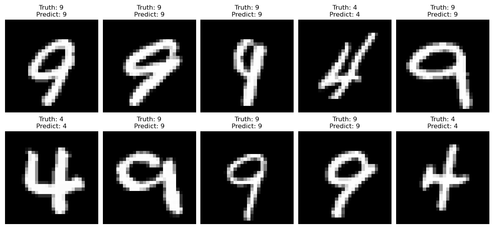
    <figcaption>图1 组合4和9的部分测试样例</figcaption>
</div>
<div style="text-align: center;">
    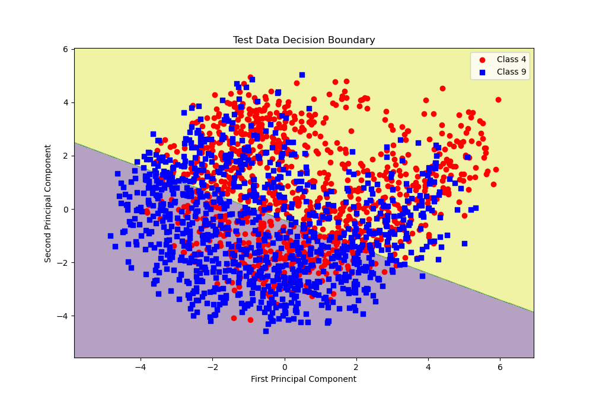
    <figcaption>图2 组合4和9的超平面分割图</figcaption>
</div>

### 1.2 数字组合4和6

图3展示了组合4和6的部分测试样例。图4展示了超平面将测试集中的4和6两类点分开的示意图。
<div style="text-align: center;">
    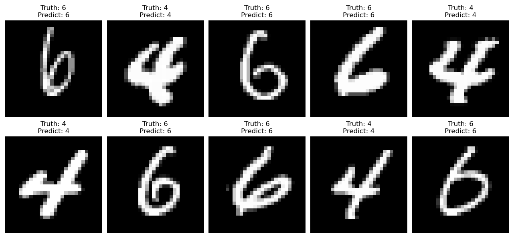
    <figcaption>图3 组合4和6的部分测试样例</figcaption>
</div>
<div style="text-align: center;">
    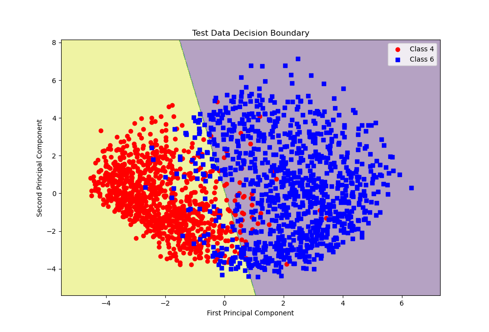
    <figcaption>图4 组合4和6的超平面分割图</figcaption>
</div>

### 1.3 数字组合0和1
图5展示了组合0和1的部分测试样例。图6展示了超平面将测试集中的0和1两类点分开的示意图。
<div style="text-align: center;">
    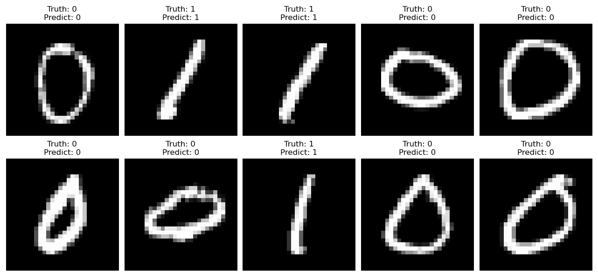
    <figcaption>图5 组合0和1的部分测试样例</figcaption>
</div>
<div style="text-align: center;">
    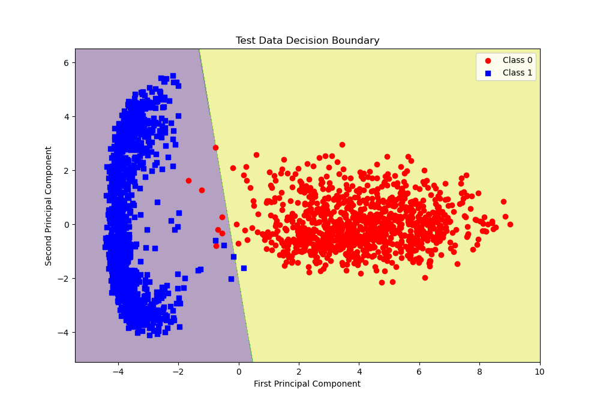
    <figcaption>图6 组合0和1的超平面分割图</figcaption>
</div>

### 1.4 组合2和7
图7展示了组合2和7的部分测试样例。图8展示了超平面将测试集中的2和7两类点分开的示意图。
<div style="text-align: center;">
    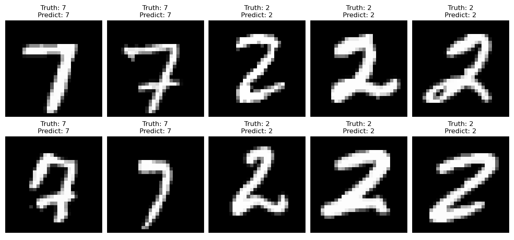
    <figcaption>图7 组合2和7的部分测试样例</figcaption>
</div>
<div style="text-align: center;">
    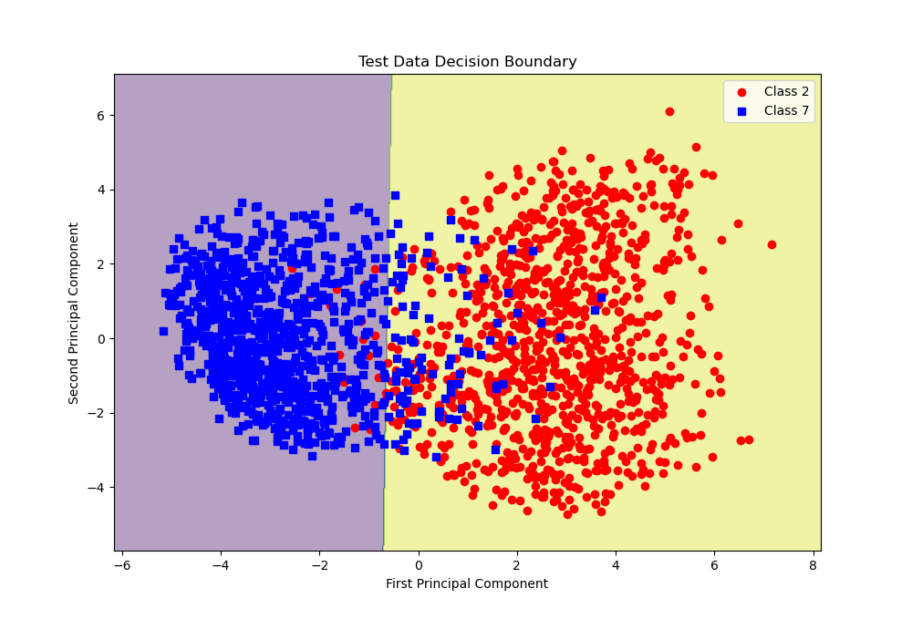
    <figcaption>图8 组合2和7的超平面分割图</figcaption>
</div>


## 2. NormSVM
在LinearSVM的基础上，NormSVM增加了一个超参数：$C$。因此，我们首先研究了不同组合下训练和测试准确率随正则化系数$C$的变化情况。结果表明，随着$C$值的增大，模型的训练准确率始终在一定范围内波动。在此过程中，测试集的表现随正则化系数$C$的变化情况与训练集基本相同。实验中，组合4和9的训练与测试准确率随$C$值的变化如图9所示。
<div style="text-align: center;">
    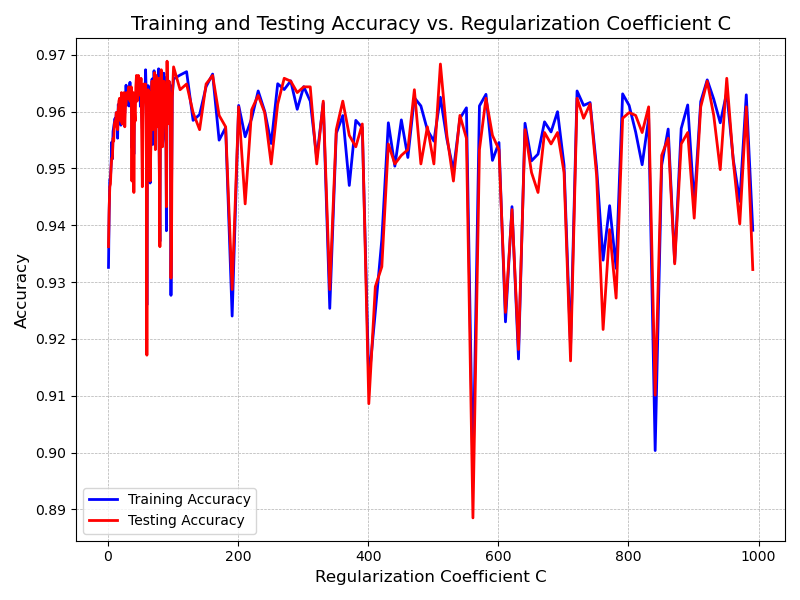
    <figcaption>图9 训练与测试准确率随$C$值的变化</figcaption>
</div>

从图9中可以看出，加入正则化系数$C$后，无论$C$值的大小，模型的表现普遍变差。我们认为，正则化本身的作用是通过控制模型复杂度来防止过拟合，特别是在数据集较小或模型过于复杂时，正则化通过减少模型的复杂度来限制其对训练数据的拟合。但是，在没有出现过拟合的情况下，这种约束可能会使得模型无法充分捕捉数据中的潜在模式，进而影响其预测能力。在本实验中，LinearSVM并没有出现过拟合问题，训练集和测试集的准确率差异较小。因此，正则化的引入并没有改善模型的性能，反而在一定程度上削弱了模型的拟合能力，并降低了模型的稳定性，导致训练准确率和测试准确率的下降。

我们取各组合中测试准确率最大时的$C$值，实验得到四种数字组合的分类准确率如表2所示。
<style>
.center 
{
  width: auto;
  display: table;
  margin-left: auto;
  margin-right: auto;
}
</style>

<p align="center">表2 NormSVM中四种数字组合的分类准确率 </font></p>
<div class="center">

| 准确率	|  4和9	| 4和6	| 0和1	|2和7 |
|:----------:|:----------:|:----------:|:----------:|:----------:|
| 训练集上的准确率	|0.9620|	0.9908|	0.9991|	0.9865|
|测试集上的准确率|	0.9613|	0.9918|	0.9991|	0.9801|

</div>


### 2.1 数字组合4和9
图10展示了NormSVM模型中组合4和9的部分测试样例。图11展示了NormSVM模型中超平面将测试集中的4和9两类点分开的示意图。
<div style="text-align: center;">
    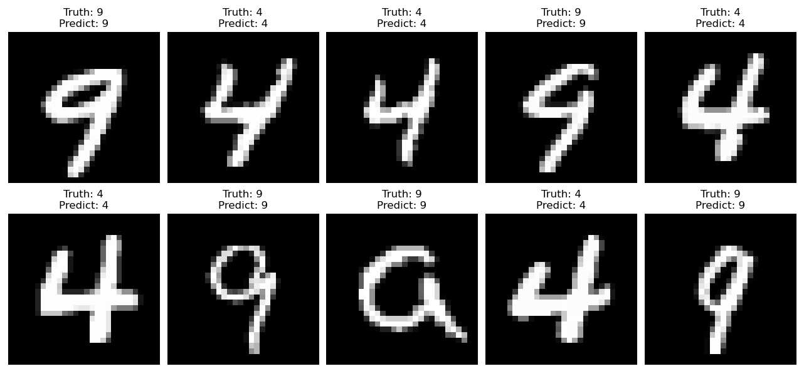
    <figcaption>图10 NormSVM模型中组合4和9的部分测试样例</figcaption>
</div>
<div style="text-align: center;">
    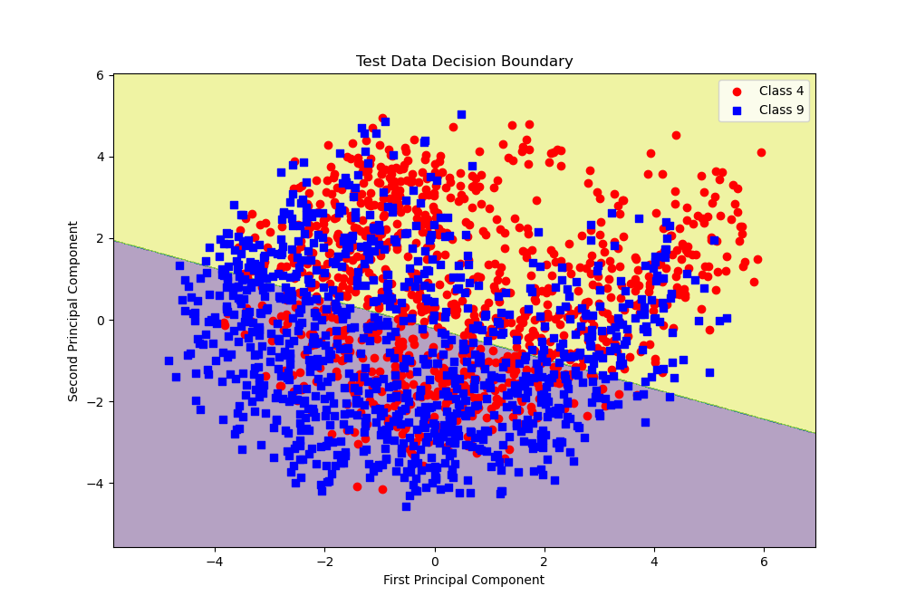
    <figcaption>图11 NormSVM模型中组合4和9的超平面分割图</figcaption>
</div>

### 2.2 数字组合4和6

图12展示了NormSVM模型中组合4和6的部分测试样例。图13展示了NormSVM模型中超平面将测试集中的4和6两类点分开的示意图。
<div style="text-align: center;">
    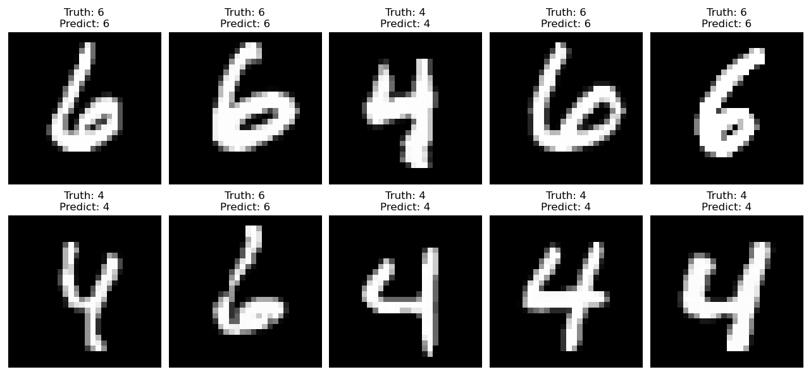
    <figcaption>图12 NormSVM模型中组合4和6的部分测试样例</figcaption>
</div>
<div style="text-align: center;">
    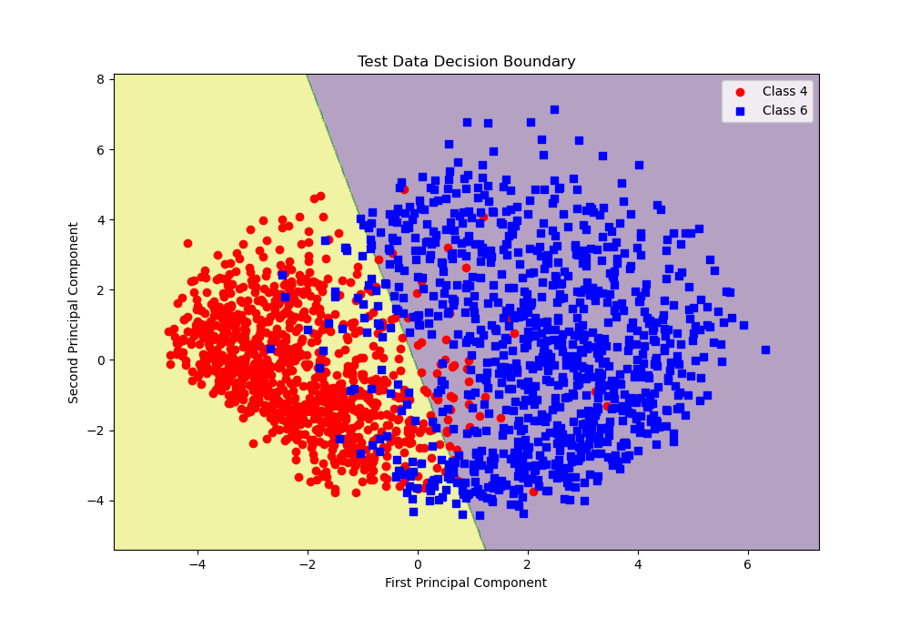
    <figcaption>图13 NormSVM模型中组合4和6的超平面分割图</figcaption>
</div>

### 2.3 数字组合0和1
图14展示了NormSVM模型中组合0和1的部分测试样例。图15展示了NormSVM模型中超平面将测试集中的0和1两类点分开的示意图。
<div style="text-align: center;">
    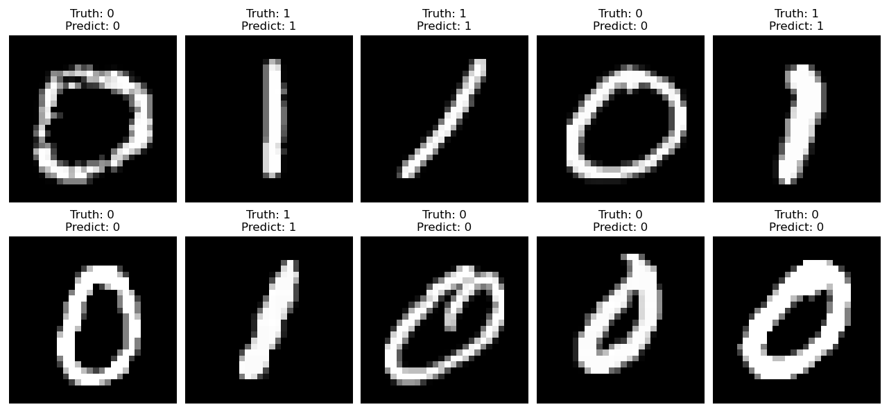
    <figcaption>图14 NormSVM模型中组合0和1的部分测试样例</figcaption>
</div>
<div style="text-align: center;">
    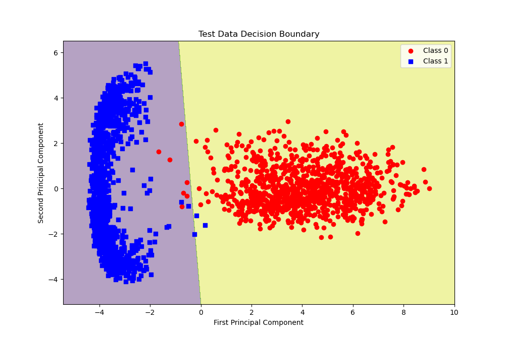
    <figcaption>图15 NormSVM模型中组合0和1的超平面分割图</figcaption>
</div>

### 2.4 组合2和7
图16展示了NormSVM模型中组合2和7的部分测试样例。图17展示了NormSVM模型中超平面将测试集中的2和7两类点分开的示意图。
<div style="text-align: center;">
    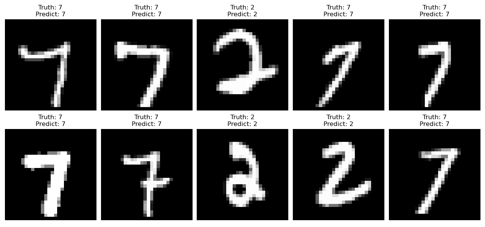
    <figcaption>图16 NormSVM模型中组合2和7的部分测试样例</figcaption>
</div>
<div style="text-align: center;">
    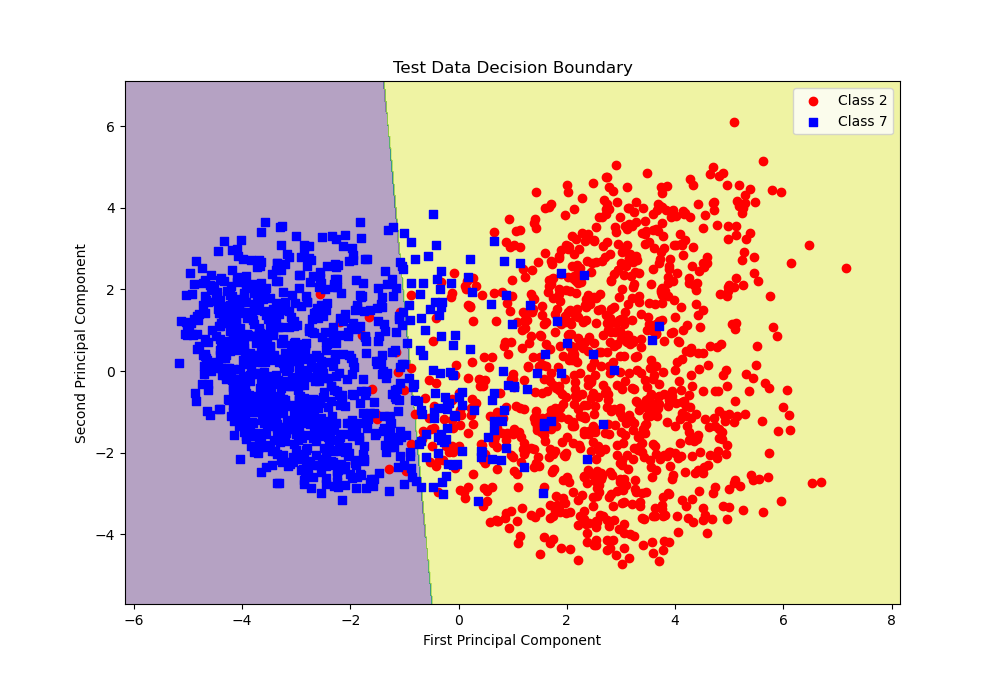
    <figcaption>图17 NormSVM模型中组合2和7的超平面分割图</figcaption>
</div>

## 3. KernelSVM
我们小组还尝试了带有核函数的SVM模型，在SVM中引入了linear核、poly核和rbf核。详见`svm.py`中的`KernelSVM`类。
### 3.1 开销分析
相比于线性的SVM, KernelSVM通过引入核函数，将数据映射到高维空间，从而实现对非线性数据的分类。
带有核函数的SVM的主要梯度下降代码如下：
```python
for i in range(n_samples):
    kernel_sum = 0
    for j in range(n_samples):
        kernel_sum += self.alpha[j] * y[j] * self._kernel_function(X[i], X[j])
```
相比于线性SVM，KernelSVM需要对每一个样本进行一次复杂度为$O(n\_samples)$的内循环计算，总计算复杂度为$O(n\_samples^2)$。因此，KernelSVM的训练开销太大，单一个iteration的计算时间都远远慢于线性SVM的100iters计算时间。而且初步实验结果表明，KernelSVM的分类准确率并没有明显提升，因此我们认为KernelSVM不适合用于本次实验的数据集，没有做进一步的探索。

### 3.2 理论分析
我们试图从理论上分析KernelSVM相较LinearSVM在MINST数据集上没有明显提升的原因。我们认为，MINST是784维的高维数据，在高维空间中数据会变得稀疏，从而线性可分。使用核函数将数据映射到更高维度，可能并无必要，反而增加了计算开销和过拟合的风险。


